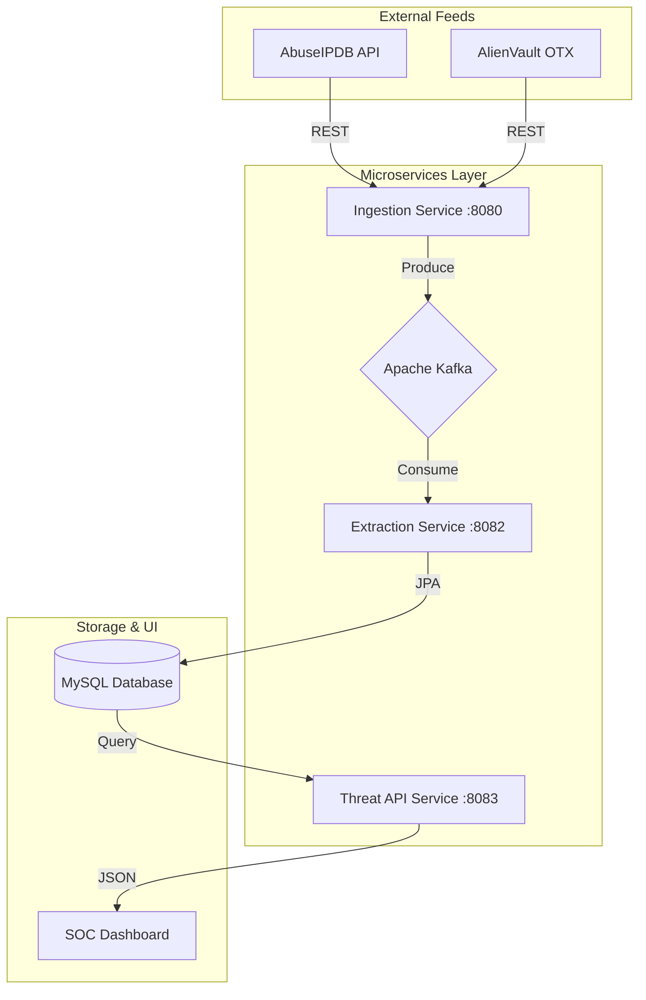

# 🛡️ Cyber Threat Intelligence Pipeline (CCP)

An automated, event-driven cybersecurity platform designed to ingest, process, and visualize Indicators of Compromise (IoCs) in real-time. Built as a **Complex Coursework Project (CCP)** utilizing Java Spring Boot, Apache Kafka, and a dark-mode SOC analytics dashboard.

## 📖 Project Overview
The **Cyber Threat Intelligence Pipeline** automates the lifecycle of threat data. It aggregates raw intelligence from global databases (**AbuseIPDB** & **AlienVault OTX**), processes it through a distributed Kafka pipeline, and serves actionable insights to security operators via a professional dashboard.

### Key Features
- **Event-Driven Microservices**: Decoupled ingestion, extraction, and API layers.
- **Real-Time Data Enrichment**: Automated severity scoring via a dedicated Ranking Service.
- **Asynchronous Processing**: High-throughput pipeline using Apache Kafka.
- **SOC Analytics Dashboard**: Live visualization of threat volume, critical alerts, and source distribution.

---

## 🏗️ System Architecture

---

## 🚀 Deployment Guide
To run the project locally, follow the **Dependency Boot Order**:

1.  **Infrastructure**: Start **WAMP Server** (MySQL) and **Apache Kafka**.
2.  **Downstream Services**: Launch the **Extraction Service** (Port 8082) and **Threat API Service** (Port 8083).
3.  **Frontend**: Open `Threat-Dashboard/index.html`.
4.  **Producer**: Start the **Ingestion Service** (Port 8080) and hit the `/ingest` endpoint.

---

## 🛠️ Technology Stack
- **Backend**: Java 17, Spring Boot 3.x
- **Messaging**: Apache Kafka 3.x
- **Persistence**: MySQL, Hibernate/JPA
- **Frontend**: Vanilla JS, HTML5, CSS3 (SOC Dark Theme)
- **Data Handling**: Jackson (JSON), RestTemplate

---

## 📂 Documentation
For deep technical details, implementation logic, and system configurations, please refer to:
- 📄 **[TECHNICAL_REPORT.md](./TECHNICAL_REPORT.md)**: Full architecture blueprints, data schemas, and security measures.

---

## 🧩 CCP Mapping
- **WP1-WP9 Compliance**: Met via distributed system design and real-time processing complexity.
- **SDG Goals**: 
    - **SDG 9**: Industry, Innovation, and Infrastructure.
    - **SDG 16**: Peace, Justice, and Strong Institutions.

---

## 👤 Author
*Developed as part of the School of Computing Sciences, Pak-Austria Fachhochschule (PAF-IAST).*
