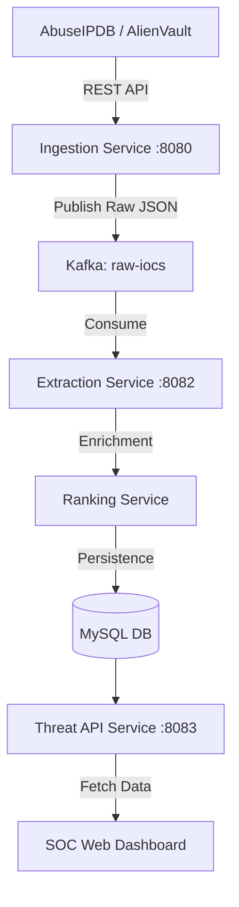

# Cyber Threat Intelligence Pipeline (CCP)

## 📋 Project Information
*   **Course:** Software Construction & Development
*   **Instructor:** Dr. Nabeel Ahmad Awan
*   **Department:** IT & CS Discipline (Software Engineering)
*   **Institution:** PAF-IAST
*   **Submission Date:** May 1, 2026

## 👥 Team Members
| Name | Registration Number |
| :--- | :--- |
| **Hamza Badshah** | B23F0352SE016 |
| **Hammad Tahir** | B23F0649SE087 |
| **Hafsa Khan** | B23F0580SE009 |
| **Aman Sajid** | B23F0107SE081 |
| **Esha Chatta** | B23F0403SE077 |

---

## 🚀 Introduction
The **Cyber Threat Intelligence Pipeline (CCP)** is a highly scalable, event-driven microservices system designed to ingest, analyze, and visualize cyber threat indicators in real-time. Modern Security Operations Centers (SOCs) face a deluge of data; this pipeline automates the aggregation of raw Indicators of Compromise (IoCs) from global databases like **AbuseIPDB** and **AlienVault OTX**, enriching them with severity scores before serving them to a live dashboard.

## 🏗️ System Architecture
The system utilizes a decoupled microservices architecture with **Apache Kafka** acting as the central message broker.

### Key Benefits:
*   **Scalability:** Services can be scaled independently.
*   **Fault Tolerance:** Kafka buffers data if the database or consumer services go offline.
*   **Polyglot Ready:** Future modules (e.g., Python ML) can be easily integrated.

---

## 🛠️ Technical Specifications

### 1. Ingestion Service (Port 8080)
*   **Role:** Data Producer.
*   **Implementation:** Fetches data from external feeds via `RestTemplate`.
*   **Sources:** AbuseIPDB (v2 blacklist) & AlienVault OTX (v1 pulses).
*   **Output:** Publishes raw payloads to the `raw-iocs` Kafka topic.

### 2. Extraction & Processing Service (Port 8082)
*   **Role:** Data Consumer & Enrichment.
*   **Logic:** Uses `@KafkaListener` to ingest data, validates JSON via Jackson, and filters malformed indicators.
*   **Ranking Service:** Generates a deterministic "Enriched Severity Score" (0-100) for every threat.
*   **Persistence:** Saves objects to MySQL via Hibernate/JPA.

---

## 📊 Data Modeling
The MySQL database stores threat data in the `iocs` table:
*   `id`: Primary Key (Auto-Increment)
*   `ioc_value`: The malicious IP/Domain
*   `ioc_type`: Classification (e.g., "IP")
*   `severity_score`: Integer (0-100)
*   **Source:** Originating API (AbuseIPDB or AlienVault)
*   **Created At:** Automatic timestamp handled by the database.

---

## 💻 Presentation Layer: SOC Dashboard
A native **dark-themed terminal** dashboard built with:
*   **Vanilla JavaScript:** Optimized for speed and low overhead.
*   **Async/Await Fetch:** Continuous polling for real-time updates.
*   **KPI Engine:** On-the-fly calculation of "Critical Volume" and "Source Distribution".
*   **Dynamic UI:** Neon-red highlighting for high-severity threats (Score > 80).

---

## ⚙️ Deployment & Operations Guide
Follow this strict boot sequence for local execution:

1.  **Infrastructure:** 
    *   Launch **WAMP Server** (MySQL on port 3306).
    *   Start **Apache Kafka** (`kafka-server-start.bat`).
2.  **Consumers:** 
    *   Run **Extraction Service** (Port 8082).
    *   Run **Threat API Service** (Port 8083).
3.  **Frontend:** 
    *   Open `index.html` in a web browser.
4.  **Producer:** 
    *   Run **Ingestion Service** (Port 8080).
    *   Trigger `/ingest` endpoint to start the data flow.

---

## 🔮 Future Scope
*   **Containerization:** Full Docker & Kubernetes orchestration.
*   **ELK Stack:** Integration with Elasticsearch/Kibana for historical analytics.
*   **ML Integration:** Anomaly detection models using Python-based Kafka consumers.

---
*© 2026 CCP Team - Software Engineering Department, Developed as part of the School of Computing Sciences, Pak-Austria Fachhochschule (PAF-IAST)*
